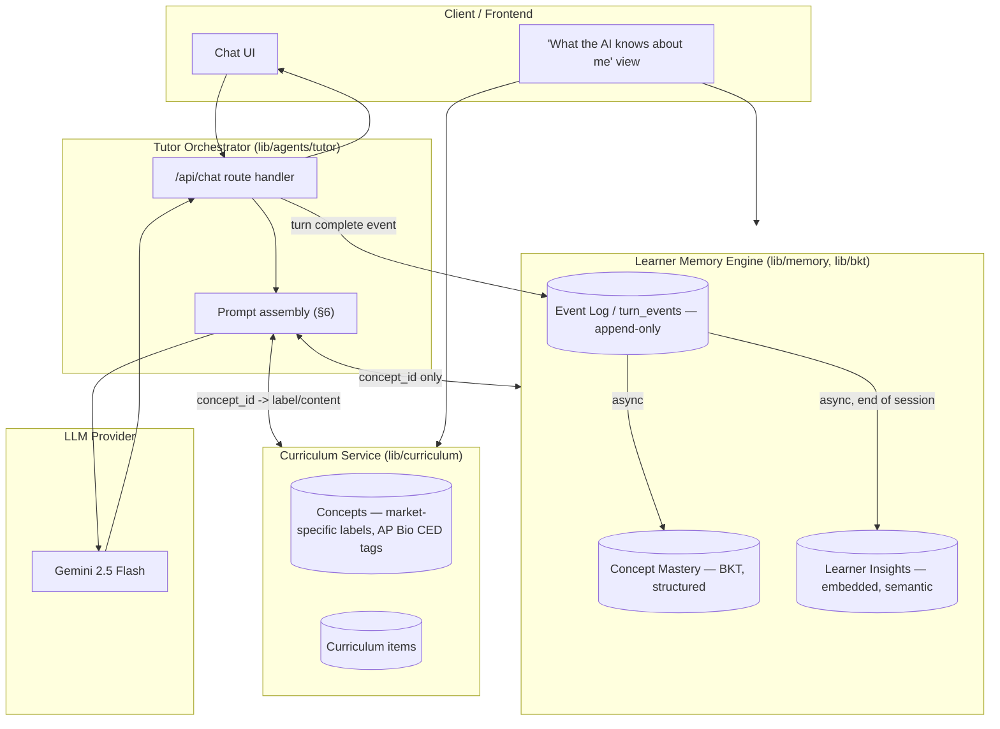

# RocketMan Learner Memory System — Design Doc

**Author:** Senior Product Engineer (design pass)
**Date:** 2026-07-20
**Status:** Revised after architecture review — see §0

---

## 0. Revision note

This is a rewrite of an earlier draft. The earlier version treated "Memorang
serves customers across different markets... understanding which ones
matter is part of the exercise" as an instruction to build literal
multi-tenant infrastructure (tenant scoping on every table, a deferred
Instructor/Cohort agent, a two-axis skill taxonomy framed as generic
pluggability). On review, that was solving a problem the exercise didn't
ask to have solved in code. The correction, adopted here:

- **Curriculum content is decoupled from the memory engine through an
  opaque `concept_id`.** The memory engine (mastery tracking, insights)
  never reads AP-Bio-specific fields directly — it only ever sees
  `concept_id`. A separate Curriculum Service resolves what that ID means
  per market. This *is* a real architectural answer to "which markets
  matter," and it costs an ID indirection, not a rewrite.
- **Market-awareness is a small, real, working feature** (a `market_id` /
  `age_band` on the learner that adjusts tone/vocabulary in the prompt),
  not speculative infrastructure for markets this build will never touch
  (no geographic sharding, no separate Instructor/Cohort role, no literal
  multi-tenant data isolation — v1 is one tenant, one market, by design).
- **Semantic memory is reframed** from "one narrative summary per
  session" to discrete, embedded **Learner Insight** facts ("confuses
  mitosis/meiosis," "responds well to car analogies"), retrieved by
  similarity to the *current* question and wrong answer — a sharper
  retrieval target than "recent sessions on this topic."
- **Prompt construction gets a concrete token budget and template**,
  replacing prose guidance with actual numbers and a structured
  Markdown+JSON format.

Everything else — BKT for structured mastery, async memory updates
decoupled from the response path, PII minimization, the AP Bio
content grounding — carried forward from the earlier pass and is folded
into the sections below.

**Since this revision, three more capabilities were added, each in
direct response to explicit follow-up requests rather than speculative
scope expansion.** Rather than rewrite the sections above and disturb
their numbering/cross-references, they're documented as new sections
§11–§13: real multi-learner authentication (reversing the original
"single learner, no adversarial users" scoping), a comprehension-check
loop paired with a computed topic-completion signal, and a cached
per-topic podcast feature. §1's "single learner" framing and §10's
concept/misconception counts are updated inline to match.

---

## 1. Problem framing

Today RocketMan gives the same feedback to every learner for the same
wrong answer. The gap isn't content — ACME/Memorang already has item banks
and explanations — the gap is that the tutor has no **memory** of the
individual learner: what they're weak on, what misconceptions they hold,
how they respond to different kinds of help, and whether their
understanding is improving or decaying over time.

The deliverable is a **learner memory system**: a profile that is built
and updated continuously from chat interactions, that the tutor reads
from on every turn to personalize its response, and that the learner can
inspect directly.

Scope for this pass: AP Biology exam prep, real multi-learner accounts
(username/password, §11) with per-learner memory, chat-based tutoring,
single tenant, single market. §2 explains why the architecture doesn't
need to be bigger than that to still take "which markets matter"
seriously.

---

## 2. Why the multi-market question matters here — and what actually answers it

Memorang sells prep across many credentialing markets (other AP subjects,
nursing/NCLEX, medical boards, professional certification, K-12). The
question the exercise poses isn't "build for all of them" — it's
"understand which ones matter, and why, for *this* system." Two concrete
design decisions are the actual answer, not a paragraph of narrative:

**1. The memory engine never speaks curriculum.** Mastery tracking,
insight retrieval, and the BKT math operate entirely on an opaque
`concept_id`. A separate **Curriculum Service** owns the mapping from
`concept_id` to human/market-specific meaning — "AP Biology > Cellular
Energetics > ATP Hydrolysis" for this build, "GCSE Biology > Cell Energy"
or "NCLEX > Pharmacology > Dosage Calculation" for a market this build
will never touch. Swapping markets means loading a different Curriculum
Service mapping; it never means touching the mastery/insight schema or
the BKT engine. That's the difference between "designed so a future
market doesn't require a rewrite" and "built for six markets nobody asked
for."

**2. Market-awareness is a real, cheap, working lever — not
infrastructure.** `learners.market_id` and `learners.age_band` are real
columns, read by the Tutor Agent's prompt construction to adjust
vocabulary/tone/formality (§6). v1 seeds exactly one market (`us-ap-bio`,
age band `14-18`), so this doesn't visibly do much *today* — but it's
wired end-to-end, not a placeholder, which is what makes it an honest
answer to "which markets matter" rather than a speculative one.

**What's deliberately *not* built, and why:** multi-tenant data isolation
(RLS, geographic sharding, an org-scoped `tenant_id` on every table), an
Instructor/Cohort role, and data-residency handling. These are real
concerns for Memorang's actual nursing/medical markets (higher stakes,
institutional customers who want cohort analytics, compliance regimes
that require data to stay in-region) — but nothing in the acceptance
criteria asks for them, and building them now would be exactly the
speculative-infrastructure mistake this revision is correcting. §9 (was
§8) records this as an explicit, flagged scope boundary, not an oversight.

---

## 3. High-level architecture

Four logical services, one physical deployment for v1 (a single Next.js
app + one Postgres/pgvector database) — the separation is a module
boundary in the code, not a network boundary, which is the right call at
demo scale but keeps the seam where a real split would happen later.



The critical property: **`PromptBuilder` and everything in
`MemoryEngine` only ever pass `concept_id` between each other.** Neither
the BKT engine nor the insight-retrieval code contains an AP-Biology-shaped
field. Only `Curriculum` resolves `concept_id` into a label, a unit, a CED
tag, or a teaching passage.

---

## 4. Core components of the Learner Memory Engine

Three memory types, matching the reference architecture's split — it maps
more cleanly onto what a tutor needs at inference time than the
cognitive-science-flavored "semantic/episodic/procedural" framing the
earlier draft used.

### 4.A Short-term memory (session context)

Tracks the immediate conversation so replies stay coherent turn to turn.

- **Storage:** the sliding window itself needs none — the client
  (`useChat`) already holds the full message list and resends it each
  turn; the route handler (`app/api/chat/route.ts`) reconstructs the
  window from that via `windowMessages` (`lib/agents/tutor/history-window.ts`),
  no Redis needed at demo scale (§9, A3). The swappable seam is the same
  one noted in the earlier draft: a real session cache drops in later
  without touching the agent.
- **Data:** last 8 turns (`SESSION_HISTORY_WINDOW_TURNS`), the
  currently-selected concept/topic.
- **History compaction — implemented, not just designed.** Once a session
  passes 8 turns, an async Inngest function (`compactSessionHistoryFn`,
  triggered off the same `turn_event/created` event Signal-Extraction
  reacts to, independent of it) compacts the turns that fell out of the
  window into a 1–2 sentence rolling summary and persists it on
  `sessions.history_summary` — unlike the sliding window, *this* does need
  a dedicated column, since it must survive across requests rather than
  being reconstructible from what the client resends. Read back into the
  prompt as a `# EARLIER IN THIS SESSION` block, kept *above* the sliding
  window (`lib/agents/tutor/prompt.ts`), never as a fake message in the
  `messages` array. Session-scoped and ephemeral — distinct from the
  long-term Learner Insights below, which are learner-scoped and meant to
  outlive the session; this summary is not.

### 4.B Long-term structured memory (concept mastery)

Tracks *what* the learner knows. Purely quantitative, purely
deterministic math — no LLM call inside it (this is also the
hallucination guardrail, §7).

- **Storage:** Postgres.
- **Mechanism:** Bayesian Knowledge Tracing. Each graded interaction
  produces a posterior update to `mastery_prob` for the relevant
  `concept_id`; `mastery_prob` is read through a time-decay function so an
  untouched concept softens over time rather than staying a
  monotonically-increasing scoreboard.
- **What changed from the earlier draft:** no `preferred_scaffold` enum
  on this table anymore. Style/preference is qualitative and belongs in
  4.C as a freeform insight ("responds well to car analogies") — forcing
  it into a closed enum (`analogy | worked_example | socratic_questioning
  | direct`) was the wrong shape for something this open-ended.

### 4.C Long-term semantic memory (Learner Insights)

Tracks *how* the learner learns. Qualitative, LLM-generated, embedded for
retrieval.

- **Storage:** Postgres + `pgvector` (no separate vector DB needed at
  this scale, per the original build's reasoning — a managed vector store
  is a swap-in later, not a v1 requirement).
- **Data shape:** discrete facts, not session narratives — `"Responds
  exceptionally well to automotive/mechanical analogies," "Tends to
  confuse the inputs and outputs of cyclic pathways," "Frustrated by
  dense text, prefers step-by-step hints."` Each is its own row with its
  own embedding.
- **Retrieval:** top-3 by cosine similarity to *the current question text
  combined with the learner's current answer* — not "the last N sessions
  on this topic." This is sharper: if the learner is struggling with a pathway
  right now, the system retrieves "confuses cycle inputs/outputs" and
  ignores an irrelevant insight like "struggles with genetics
  vocabulary," regardless of when either was recorded.
- **Misconceptions get a structured specialization, not pure freeform
  text.** A general style insight ("likes car analogies") never needs
  reliable counting. A misconception the profile view wants to say "you've
  made this error 3 times" about does — semantic similarity matching
  alone isn't reliable enough to dedupe/count occurrences of the same
  misconception across sessions. So misconceptions keep a small
  structured catalog (`misconceptions` + `learner_misconceptions`, with a
  `scope: content | practice` field — content-tied vs. cross-cutting
  reasoning-pattern errors like "restates evidence instead of explaining
  mechanism," which should accumulate as one strengthening signal across
  unrelated topics, not four separate low-confidence flags that never
  individually cross a "worth mentioning" threshold). Both live under
  "long-term semantic memory" conceptually; they just have different
  storage shapes suited to different reliability needs.

---

## 5. Data model

| Entity | Key attributes | Purpose |
|---|---|---|
| `tenants` | `id`, `name` | Org boundary. One row in v1; exists so the seam isn't a schema migration later. |
| `users` | `id`, `username`, `password_hash`, `role` (`learner`\|`tutor`\|`evaluator`) | Authentication identity (§11) — kept separate from `learners` rather than columns on it, since credentials/role are an identity concern distinct from being an AP-Bio learner profile. `evaluator` is still schema-only; `tutor` has a real console + a suggestion-writing capability (§21). |
| `tutor_profiles` | `id`, `tenant_id` (unique), `name`, `tone`, `formality`, `vocabulary_level` | One row per tenant, read by prompt construction (§6) — makes "how the tutor presents itself" a queryable fact instead of a string hardcoded into a prompt template. (Named "Tutor Profile" rather than "persona" — it's a configurable presentation profile, not a claim about market-specific personas this build doesn't yet have.) |
| `learners` | `id`, `tenant_id`, `user_id` (nullable), `market_id`, `age_band` | Links the learner to an org and a market. `market_id`/`age_band` are read by prompt construction (§6) — a real, if currently single-valued, lever. `user_id` links to the authenticated account that owns this profile (§11); nullable so the original pre-auth seed learner keeps working as internal test data, permanently unreachable through login. |
| `concepts` | `id`, `tenant_id`, `unit_code`, `unit_label`, `content_lo_code`, `content_lo_label`, `science_practice_code`, `science_practice_label` | Owned by the Curriculum Service. Two-axis (content LO × science practice) per the AP Bio CED grounding in §8 — but the Memory Engine (§4.B/§4.C, the BKT engine) never queries these columns; it only ever holds a `concept_id` foreign key. |
| `concept_prerequisites` | `concept_id`, `prerequisite_concept_id` | Nodes + edges, owned by the Curriculum Service. |
| `bkt_concept_params` | `concept_id`, `p_init`, `p_learn`, `p_guess`, `p_slip`, `source` | BKT constants as data, not code — can be recalibrated from real item-difficulty data (§8 point 3) without a deploy. |
| `concept_mastery` | `learner_id`, `concept_id`, `mastery_prob`, `confidence`, `attempts`, `last_practiced_at` | The quantitative state (§4.B). No style/preference field — see §4.B. |
| `concept_mastery_history` | `learner_id`, `concept_id`, `mastery_prob`, `recorded_at` | Append-only, feeds the profile view's trend chart. |
| `misconceptions` / `learner_misconceptions` | catalog + join (`code`, `label`, `scope`, `related_concept_id`, `evidence_count`, `status`) | Structured specialization of semantic memory (§4.C) — needs reliable counting, unlike freeform insights. |
| `learner_insights` | `id`, `learner_id`, `source_session_id` (nullable), `summary_text`, `embedding`, `created_at`, `retention_until` | Discrete embedded facts (§4.C). Replaces the earlier draft's `session_summaries` — one flexible table instead of a rigid per-session narrative. |
| `sessions` | `id`, `learner_id`, `started_at`, `ended_at`, `status` | Groups turns for the "end session" consolidation trigger. |
| `turn_events` | `id`, `learner_id`, `session_id`, `concept_id`, `learner_message`, `tutor_message`, `hints_used`, `status` | **Event Log**: append-only ledger of every interaction. Durable pre-processing log *and* the queue substitute (§9, A3) — written before any async work starts, so a pending row surviving here is what lets a sweep endpoint recover a dropped background callback. Also means mastery is, in principle, recomputable from raw events if curriculum ever changes — not built as a v1 feature, but the ledger makes it possible later. |
| `learner_assertions` | `id`, `learner_id`, `concept_id`, `assertion_type`, `note` | Learner-correctable evidence ("actually I know this now") — a direct, trusted mastery update, no LLM classification in this path. |
| `curriculum_items` | `id`, `concept_id`, `prompt_text`, `teaching_content` | Owned by the Curriculum Service; what the Tutor Agent grounds factual claims in. Also doubles as the source material for cached podcasts (§13) and the bank of check questions the Tutor Agent draws from (§12). |
| `concept_podcasts` | `id`, `tenant_id`, `concept_id` (unique together), `script_text`, `audio_path`, `created_at` | Cached per-topic audio (§13) — generated once, served from cache on every subsequent listen. |

Every table still keeps `tenant_id` (cheap, already-paid-for insurance),
but there is no `market_id` scattered across every table the way the
earlier draft scattered `tenant_id` — market only needs to live on
`learners`, because that's the only place prompt construction reads it
from.

---

## 6. The system workflow: processing a wrong answer

1. **Ingestion.** The learner answers an ATP-hydrolysis question
   incorrectly. The client sends the interaction to the Tutor
   Orchestrator (`/api/chat`).
2. **Context retrieval.** The Orchestrator asks the Memory Engine for:
   - the decayed `mastery_prob` for the current `concept_id`, plus 2–4
     sibling/parent concepts (Tactic A below) — **not** the learner's
     entire mastery history;
   - the top-3 `learner_insights` by similarity to the current question +
     the learner's wrong answer (Tactic B);
   - active misconceptions tied to this concept or cross-cutting.
   It asks the Curriculum Service for the concept's label/hierarchy and
   the grounding teaching passage.
3. **Prompt assembly** (see the template below).
4. **Response generation.** Gemini streams a scaffolded hint whose
   directness is a function of the decayed mastery score.
5. **Memory update (asynchronous).** The Tutor Agent does not write to
   memory directly — it writes one `turn_events` row and fires an
   unawaited background callback (`after()`), with a pending-row sweep as
   the correctness backstop (no real message broker at demo scale, §9
   A3). The Signal-Extraction Agent classifies correctness/misconception
   and applies the BKT update; the Consolidation Agent, at session end,
   extracts 0–3 new `learner_insights`.

### Token budget

Modern context windows are far larger than 8K, but "fits under the limit"
isn't the goal — cost scales with tokens sent regardless of window size,
and models are measurably worse at using information buried in a long,
undifferentiated context. Budget deliberately:

| Prompt section | Token budget | Strategy |
|---|---|---|
| Core tutor profile & instructions | ~400 | Static, cached. |
| Pedagogical constraints | ~300 | Static, cached. |
| Learner memory (mastery + insights) | ~600 | Dynamic — sharded mastery + top-3 insights, never the full profile. |
| Conversation history | ~1,000–2,000 | Dynamic — sliding window of last 6–8 turns, older turns compacted (§4.A). |
| User input & response buffer | remaining | — |

### Structured prompt template

LLMs parse structured key-value data more reliably than prose baked into
instructions. The dynamic context block is Markdown headers wrapping a
JSON payload:

```md
# TUTOR PROFILE
You are RocketMan, ACME's expert, empathetic AI tutor. Guide students to
the correct answer using Socratic questioning; never give the answer away
directly unless they explicitly ask or have clearly struggled a while.

# PEDAGOGICAL CONSTRAINTS
- Adapt vocabulary to the learner's age band.
- Use analogies matching the learner's documented interests (from insights).
- If mastery < 0.4 for the current concept, break it into smaller sub-steps.
- Ground every factual claim in the retrieved curriculum passage. If nothing
  relevant was retrieved, say so rather than answering from general knowledge.
- Once the core idea has been explained, pose one of the check questions
  below and require an actual attempt at an answer -- don't accept a vague
  "does that make sense?" / "ok, got it" as evidence of understanding (§12).

# CURRENT LEARNER CONTEXT
{
  "market_profile": { "market_id": "us-ap-bio", "age_band": "14-18" },
  "concept_mastery": {
    "atp_hydrolysis": 0.31,
    "cellular_energetics": 0.72,
    "glycolysis": 0.55
  },
  "active_misconceptions": [
    "Confuses inputs/outputs of cyclic pathways"
  ],
  "semantic_insights": [
    "Responds exceptionally well to automotive/mechanical analogies.",
    "Frustrated by dense text blocks; prefers step-by-step hints."
  ]
}

# CURRENT TASK
Concept: ATP Hydrolysis (mastery 0.31)
Question: "What is the primary role of ATP in cellular processes?"
Student's incorrect answer: "It creates energy out of nothing to power the cell."

# CHECK QUESTIONS
- "A student says 'ribosomes package and secrete proteins out of the cell.'
  What is wrong with this statement, and what is the correct role of the
  ribosome?"
- "Why can't cells just keep growing larger instead of dividing?"

# CONVERSATION HISTORY
[...sliding window of the last 6-8 turns, or a compacted meta-summary
 followed by the recent window if the session has run long...]

# LEARNER INPUT
Student: "Wait, why is that wrong? Doesn't it make energy?"
```

### Three pruning tactics (what keeps the "learner memory" section lean)

- **Tactic A — relevant mastery sharding.** Never inject the full mastery
  table. Take the current `concept_id`, look up its parent unit and
  siblings (same `unit_code`) plus any `concept_prerequisites` edges, and
  inject only those 2–4 scores.
- **Tactic B — top-K semantic retrieval.** Embed the current question +
  the learner's latest answer; query `learner_insights` for the top 3 by
  cosine similarity. Irrelevant insights (a genetics-vocabulary note
  while discussing ecology) never make it into the prompt.
- **Tactic C — history compaction.** Sliding window of 6–8 turns; once a
  session exceeds that, an async step compacts older turns into a 1–2
  sentence rolling summary appended above the window (§4.A) — not stored
  as a long-term `learner_insight`, since it's about *this conversation*,
  not a lasting trait.

---

## 7. Agent operational guardrails

Carried forward from the earlier draft with updated terminology:

- **Performance:** Tutor Agent streams, first token target ~1–2s.
  Signal-Extraction and Consolidation run async, off the critical path.
- **Hallucination:** BKT math is deterministic and outside any LLM call —
  the Signal-Extraction Agent only classifies into structured fields,
  which are validated against real `concept_id`/misconception codes
  before the BKT engine applies them. The Tutor Agent grounds factual
  claims in the retrieved curriculum passage and declines rather than
  guesses outside it. The profile view never shows a claim that isn't
  traceable to a stored attempt/insight.
- **Privacy:** prompts reference an internal `learner_id` only — no
  name/email ever enters LLM context. Learner chat input is treated as
  untrusted data, never instructions (prompt-injection guard). Every
  memory-write is scoped to the current session's learner.

---

## 8. AP Biology content grounding (Curriculum Service detail)

This section is unchanged in substance from the earlier draft — it now
lives explicitly under the Curriculum Service, and none of it is visible
to the Memory Engine's BKT/insight code, which only ever sees
`concept_id`.

Pulling the [2025 AP Bio FRQs](https://apcentral.collegeboard.org/media/pdf/ap25-frq-biology.pdf)
against the concept graph confirmed it isn't a clean one-question-one-concept
mapping: every question mixes a **content axis** (Unit → Learning
Objective) with a **science-practice axis** (identify variables, read
data, quantitative reasoning, argue from evidence, explain a concept,
predict from a model) — the same six practices recurring across all eight
content units, matching how College Board's own CED is actually
structured. Consequences already reflected in §5's `concepts` table:

- Each concept is a `(content_lo_code, science_practice_code)` pair, not
  just a content node — a learner can be solid on cellular-energetics
  *content* and still consistently miss "state the null hypothesis," a
  practice-level gap that recurs across ecology, genetics, and evolution
  alike.
- College Board already publishes this two-axis tagging with exact codes
  (`Skill 3.C`, `Skill 6.C/D`, `LO ENE-2.G`, etc., from the [Chief Reader
  Report](https://apcentral.collegeboard.org/media/pdf/ap25-cr-report-biology.pdf)) —
  so for AP-subject content this is an ingestion question, not a build
  question. v1 hand-seeds concepts against this shape rather than
  ingesting a full item bank (§10) — 13 concepts spanning all 8 real AP
  Bio units (initially 7 concepts across 5 units; expanded after a
  coverage review against the College Board syllabus found 3 units
  entirely missing), with 19 misconceptions (multiple per unit, versus
  one each initially) and 25 curriculum items.
- The Chief Reader Report is also a free calibration source: published
  population mean scores per scoring point let `bkt_concept_params` seed
  from real item-difficulty data instead of a neutral prior, for any
  concept that overlaps a released FRQ (§5, `source: cb_population_data`).
- The report's teacher-advice sections independently flag one
  cross-cutting error as the most common failure mode on the exam:
  "support" (restating evidence) vs. "justify" (explaining mechanism) —
  the concrete case for the `scope: practice` misconception design in
  §4.C.

---

## 9. Assumptions and open questions

Nothing below has been confirmed with ACME/Memorang stakeholders — this
is a solo design pass. Recorded so they're visible as assumptions to
challenge, not settled facts.

**Open question (genuinely unresolved):**

1. Does Memorang's current AP Bio item bank already carry College
   Board's LO/Skill codes (or map to them 1:1), or would ingestion require
   re-tagging from scratch? Assuming re-tagging is required until told
   otherwise (the conservative estimate for scoping the Curriculum
   Service).

**Working assumptions:**

- **A1 — Retention:** assuming no retention policy exists today and none
  needs enforcing for v1. `learner_insights.retention_until` is a
  nullable TTL column from day one regardless, so a future policy is a
  query and a scheduled job, not a migration.
- **A2 — Instructor/institution role:** Memorang's higher-stakes markets
  (nursing, medical boards) plausibly need one eventually, given
  institutional customers who'd want cohort analytics rather than raw
  transcripts. Not built, not designed around, for v1 — per §2, this is
  the kind of speculative infrastructure the revision explicitly avoids.
  If it becomes real, it's additive: a new agent reading the same
  `concept_mastery` table, aggregated, never touching individual
  transcripts.
- **A3 — Demo vs. production scope:** assuming this build is a
  demo/exercise, not production-volume — inferred from the "free tier"
  framing of the suggested tools. Redis/a real message broker would be
  the correct target architecture at real scale; v1 keeps the
  fast-loop/slow-loop *separation* (a correctness property) but
  implements it with an in-process background task + pending-row sweep
  instead (§6).

---

## 10. MVP scope vs. stretch

**MVP (matches acceptance criteria):**

- Concept graph seeded for AP Bio (13 concepts across all 8 CED units,
  two-axis) with BKT mastery tracking + time-decay.
- Real learner accounts (§11) — chat interface: streaming, scaffolded
  responses driven by mastery, grounded in retrieved curriculum content
  and check questions (§12), tone adjusted by market/age band.
- Profile view: mastery heatmap with a computed completion signal (§12),
  misconception list, trend, learner insights shown with "based on your
  last N attempts" transparency, learner-correctable evidence.
- Async Signal-Extraction + Consolidation loop; Event Log
  (`turn_events`) as the durable backstop.
- Cached per-topic podcast audio (§13).
- Single tenant, single market, single subject — but real, distinct,
  authenticated learners within it, not one demo learner.

**Explicitly deferred:**

- Instructor/Cohort views and role (§9, A2).
- Procedural/bandit-style scaffold optimization — style preference is a
  freeform insight in v1, not a learned policy.
- A second market's Curriculum Service mapping — the `concept_id`
  indirection makes this additive later, not a rebuild, but a second
  mapping isn't loaded until a second market is real.
- Redis/message broker infrastructure, multi-tenant data isolation,
  geographic sharding (§9, A3; §2).

---

## 11. Authentication and authorization

Added in direct response to a scope reversal: the original framing
(§1's earlier "single learner" wording, §9's implicit "no adversarial
users" assumption) held only as long as there was one demo learner and
no login. Once real accounts were requested, every route that reads or
writes learner-specific data had to actually check who's asking — a
login form in front of routes that still trusted a client-supplied
`learner_id` would have been theater, not security.

- **Identity lives in `users`, not on `learners`** (§5) — `username`,
  `password_hash` (bcrypt), and a `role` enum (`learner` \| `tutor` \|
  `evaluator`). Kept as a separate table rather than columns on
  `learners` because credentials and role are an identity concern, not
  an AP-Bio-learner-profile concern — a future tutor or evaluator
  account is a `users` row that never needs to become a `learners` row.
  `role` was schema-only at first (no tutor/evaluator UI), matching the
  same don't-build-speculative-infra principle as §2/§9 A2. **No longer
  true for `tutor`** — a read-only roster (`/tutor`) shipped, then a
  per-learner drill-down with a suggestion-writing capability (§21).
  `evaluator` remains schema-only; there's still no UI or route for it.
- **Sessions are a signed, httpOnly cookie** (`jose`, HS256, 7-day
  expiry) carrying only `{ learnerId }` — no name/email, consistent
  with the PII-minimization guardrail in §7. Passwords are hashed with
  `bcryptjs` (pure JS, safe in serverless bundling, unlike the native
  `bcrypt` bindings).
- **A single DAL function, `getSessionLearnerId()`, is the only source
  of truth**, called directly from every protected Route Handler and
  Server Component. Next 16 renamed Middleware to "Proxy," and its own
  bundled authentication guide is explicit that Proxy must never be the
  *sole* check — this build skips Proxy entirely and puts the real
  check in each route, which also matches this codebase's
  all-client-components style.
- **Every learner-scoped route verifies the authenticated learner
  actually owns the resource** — profile reads, mastery assertions,
  chat turns, and session-end all compare the session's `learner_id`
  against the resource being touched: 401 if unauthenticated, 403 on
  mismatch. This is the actual fix, not the login page — verified with
  a real adversarial test (two signed-up accounts, separate cookie
  jars: account A confirmed unable to read or write account B's data,
  and an unauthenticated request confirmed 401).
- **Explicitly out of scope** (flagged, not silently skipped, per this
  doc's existing convention in §9/§10): password reset, rate
  limiting/lockout on login attempts, email verification, Proxy-based
  optimistic redirects.

---

## 12. Comprehension checks and topic completion

Two gaps closed together, because they're two halves of one loop: chat
turns were always graded per-turn (§6, Signal-Extraction), but nothing
*forced* a check question to happen, and nothing surfaced "is this
topic actually done" as a legible fact on the profile view.

- **Generating the evidence:** the Tutor Agent's prompt (§6) now
  includes a `# CHECK QUESTIONS` section listing each concept's
  `curriculum_items.prompt_text` entries, with an explicit instruction
  to pose one (verbatim or lightly paraphrased) once the core idea has
  been explained, and to require an actual attempted answer rather than
  accept a vague "ok, got it" as proof of understanding. This is what
  prompts the learner to produce a gradable answer in the first place —
  without it, Signal-Extraction can only grade whatever happens to come
  up organically.
- **Surfacing the result:** topic completion is a **computed view
  value, not new stored state** — `masteryProb >= 0.85` (the same floor
  already used for trusted learner assertions in the BKT engine, §4.B),
  computed at profile-read time exactly like time-decay already is
  (§4.B) and never written back to `concept_mastery`. Storing a
  separate `is_complete` flag would mean keeping two sources of truth
  in sync (what happens when decay later drops it back below the
  line?), so it stays a pure derived value. Surfaced as a "Completed"
  badge on the mastery heatmap plus a completion count on the profile
  view.
- **A real gotcha, caught during verification, not assumed away:**
  floor-bumping mastery to exactly `0.85` via an assertion, then
  reading it back moments later, can return `0.8499998...` — the
  read-time decay function (§4.B) shaves a negligible sliver off even
  an exact value. A strict `>= 0.85` comparison on the raw float would
  silently fail right at the boundary (the UI would show "85%" with no
  completion badge). Fixed by comparing the *rounded percentage the UI
  already displays*, not the raw float.

---

## 13. Podcast / audio generation

Answers a direct question this design didn't originally address: how
content depth scales to "proper explanations/audio/video generation."
The implemented answer is per-topic cached audio — not per-message, and
not video.

- **Why per-topic, not per-message:** an earlier pass generated TTS
  audio from the tutor's literal chat reply, on demand, per message.
  That works, but a one-off spoken reply isn't reusable — every listen
  re-pays a real, metered TTS call for text that's specific to one
  conversation. A cached, per-topic podcast is the right level of
  durability for something worth pre-generating once and serving
  forever after.
- **A content-generation step precedes synthesis, deliberately.** The
  `curriculum_items.teaching_content` used to ground the Tutor Agent
  (§6, §8) is written as LLM grounding prose — dense, not written to be
  heard. `concept_podcasts` (§5) caches the output of a two-step
  pipeline: an LLM rewrites that grounding content into a short
  (~150–250 word), warm, conversational spoken script, which is *then*
  synthesized to audio — not a TTS readback of the grounding text
  itself.
- **Cache mechanics:** keyed `unique(tenant_id, concept_id)`. A cache
  hit is a DB lookup + a Storage download — no LLM or TTS call at all.
  A cache miss runs the full script-generation + synthesis pipeline,
  uploads the result to a **private** Supabase Storage bucket, and
  writes the cache row. Verified concretely: a cold request takes real
  tens-of-seconds (genuine LLM + TTS work, not instant); a warm request
  on the same topic returns in under 2 seconds with byte-identical
  audio.
- **Storage is private, proxied through an authenticated route** — same
  as every other piece of data in this app, never a direct
  client-to-Supabase call, consistent with the whole app's security
  model (§11).
- **Video generation is explicitly deferred, not silently skipped.**
  Available generative video models are experimental and shaped for
  image-to-video generation, not "turn this lesson into an explainer
  video" — a real scientific-accuracy risk for an education product,
  on top of a cost/latency profile that doesn't fit a chat-speed
  product. Flagged here the same way §2/§9 flag other deliberate scope
  boundaries.

---

## 14. Build plan: parallelizing with Claude Code

Unchanged in approach from the earlier draft — three workstreams
(Frontend, Memory Engine + Curriculum Service, Agent orchestration),
parallelizable once `/chat` and `/learner/:id/profile` contracts are
frozen, each in its own git worktree via the `Agent` tool. Sequencing:
contract freeze → parallel build → integration → security review → merge.

**Claude Code skills mapped to each workstream:**

| Skill | Where it applies | Why |
|---|---|---|
| `dataviz` | Frontend | The mastery heatmap and trend charts need a coherent color/form system — load before writing chart code. |
| `artifact-design` | Frontend | Fast prototyping of chat/profile UX before committing to the full build, if validating with stakeholders first. |
| `run` | All, during dev | Confirm streaming chat and the profile view work end-to-end, not just that tests pass. |
| `security-review` | Memory Engine + agent orchestration, before ship | Stores/infers on learner data and gives agents tool access on untrusted chat input — a dedicated pass before ship. |
| `init` | Once scaffolded | Bootstrap CLAUDE.md so contributors share project context. |

---

## 15. Content coverage: known gap, measured against the real CED

The 13 seeded concepts (§10) were never claimed to be full CED coverage —
"hand-seeds concepts against this shape rather than ingesting a full item
bank" (§8). This section makes that gap concrete rather than leaving it as
an unverified assumption, using College Board's own
[`ap-biology-course-at-a-glance.pdf`](https://apcentral.collegeboard.org/media/pdf/ap-biology-course-at-a-glance.pdf)
(the topic-level breakdown per unit, with real exam weighting).

**The real course has ~60 topics across 8 units; this build seeds 13
concepts.** Breadth is fine — all 8 units have at least one concept — but
depth is uneven, and the gaps are concentrated in some of the
*highest-weighted* material on the actual exam:

| Unit | Exam weight | Real topic count | Notably absent |
|---|---|---|---|
| 3 — Cellular Energetics | 12–16% | 5 | Photosynthesis, Cellular Respiration — arguably the two most classically-tested AP Bio topics, not represented at all |
| 6 — Gene Expression and Regulation | 12–16% | 8 | Regulation of Gene Expression, Biotechnology (PCR, gel electrophoresis, CRISPR) |
| 7 — Natural Selection | 13–20% (highest-weighted unit) | 12 | Hardy–Weinberg Equilibrium (a recurring quantitative FRQ topic), Population Genetics, Phylogeny |
| 2 — Cells | 10–13% | 10 | Membrane transport/tonicity/osmoregulation (2.4–2.8), cell compartmentalization (2.9–2.10) |
| 8 — Ecology | 10–15% | 7 | Population/community ecology depth, biodiversity, ecosystem disruption |

**What this means concretely:** a learner who asks the tutor about
photosynthesis, Hardy-Weinberg calculations, or CRISPR today gets a
response ungrounded in any retrieved `curriculum_items` row — the Tutor
Agent's own grounding constraint (§7) means it should decline rather than
guess, but that's a degraded experience on some of the highest-stakes exam
content, not an edge case.

**Deliberately not fixed in this pass.** Closing this gap means authoring
real teaching content, misconception Q&A, and BKT seeds for dozens of new
topics — a content-authoring effort roughly the size of the original
seeding pass, not a schema change. It also isn't something to do by
LLM-generating biology content unreviewed (see §16) — the same grounding
standard `content_lo_code` is held to elsewhere in this doc should apply
here too. Recorded as a known, measured gap rather than an assumption.

---

## 16. Future: subject-onboarding agent (deferred, not built)

Raised in discussion, not built — recorded here in the same spirit as §9's
open questions, so it's a visible future direction rather than a lost
thread.

**The idea:** as this product considers subjects beyond AP Biology (AP
Physics, AP Calculus, etc.), the manual process used to seed AP Bio —
read the official course framework, hand-author concepts and curriculum
items, classify question archetypes — doesn't scale per-subject. A
**Curriculum Ingestion Agent** that reads an official course framework
document and proposes `concepts`/`curriculum_items` rows is the natural
next agent.

**Why it doesn't fit the existing four-agent model, and what that implies.**
§7's four agents split on two properties: memory-write trust boundaries
(only Signal-Extraction/Consolidation write learner memory; Tutor never
does) and sync/async separation. A Curriculum Ingestion Agent writes
neither kind of thing — it writes *content that becomes ground truth for
every learner in that subject*, a higher-stakes write path than anything
currently automated here. That argues for **draft-and-review, not
autonomous-write**: the agent proposes rows (grounded with citations back
to the source framework), staged for human approval before anything
becomes what the Tutor Agent presents as fact — preserving the same
checkpoint that caught real mistakes during this build (see below), not
removing it in the name of automation.

**A concrete cautionary example from this build, not a hypothetical.**
The `frq_archetype` column (§10's follow-up work) was added with a
hardcoded `CHECK` constraint listing AP Biology's 6 specific FRQ
archetypes — a subject-specific rigidity that contradicts §2's own
`concept_id`-indirection principle (a second subject's different
archetype taxonomy would need a schema migration, not a data load). This
was a *human-reviewed* pass — a mapping table read and discussed before
shipping — and the inconsistency still wasn't caught until a later
multi-subject question surfaced it. An autonomous ingestion agent
generating content at volume, without a human reading every mapping
table, would risk compounding the same class of error across every future
subject, silently. This is the concrete argument for staged review over
autonomous writes, not an abstract caution.

**Not scoped further than this.** No staging schema, review workflow, or
agent prompt has been designed — that's real follow-on work if this
direction is pursued.

---

## 17. Tutor Agent real tool-calling: topic switching + podcast requests

**Purpose: giving the Tutor Agent a way to actually do things, not just talk
about them.** Two live-transcript bugs made the same failure mode visible:
a learner asking to switch units got a tutor that verbally agreed and then
kept teaching the old concept anyway (§6's `conceptId` was client-driven
only, invisible to the model), and a learner asking for a podcast got a
*fabricated* text transcript — stage directions and all — instead of the
real cached-audio feature that already existed (§13) but that the Tutor
Agent had no awareness of. Both are instances of one gap: the model could
only generate text, so anything outside plain Q&A got either ignored or
hallucinated into a plausible-looking fake.

**The fix, not a workaround.** Two real tool calls, `switch_concept` and
`share_podcast`, both client-resolved (no server `execute` — the AI SDK
streams the tool call to the client, which is the only place that can
actually update `conceptId` React state or play real audio). The model
picks a target from a new `# AVAILABLE TOPICS` block in its prompt (all 13
concepts, id + unit + label — cheap, same "costs nothing to have now" cost
profile as other small additions in this doc) and is explicitly instructed
never to fabricate a podcast script itself. The client validates every
tool-call id against a real fetched concept list before acting on it —
same defense-in-depth principle as Signal-Extraction's misconception-code
validation (§7): a hallucinated id is rejected, not applied.

**Why this matters beyond fixing two bugs.** This is the first place in
the app where the Tutor Agent's output can *cause* something instead of
only describing it. Every future "can the tutor just do X for me" request
is now a question of "add a validated, client-resolved tool" rather than
"hope the model's text convincingly describes doing X" — the latter being
exactly the failure mode both bugs shared.

---

## 18. Practice FRQs join the graded-evidence write path

**Correction to §6/§7's framing:** those sections describe Signal-
Extraction (plus the trusted assertion endpoint) as the complete list of
things allowed to write `concept_mastery`/`learner_misconceptions`. That's
no longer accurate — Practice FRQ submission is a third path, added
deliberately rather than discovered as a gap (the underlying write logic,
`submitFrqAnswer`, is now reachable from both the single-question and
exam-style batch submit routes — see §21). The real invariant was never
"only one named agent," it's "only narrow, validated, structured-output
LLM calls the Tutor Agent itself
never touches" — FRQ grading satisfies that bar the same way
Signal-Extraction does, so it earns the same trust.

**Why misconception detection had to move into the grading call itself,
not sit beside it.** `gradeFrqAnswer` originally only judged rubric
correctness — an FRQ answer could feed BKT mastery but never touched
`learner_misconceptions`, unlike a chat turn. The fix wasn't a second
classification pass mirroring Signal-Extraction's chat-turn shape (a
separate `generateText` call re-supplying the same question/reference/
rubric context, plus re-sending any attached diagram image) — that
would double the cost and latency of every submission to re-derive
judgments the grading call already has the full picture for. Instead
`gradeFrqAnswer` now takes the same concept-scoped candidate list
`getCandidateMisconceptions` already produces for chat, and returns
`matchedMisconceptionCodes` from the *same* pass that grades the rubric
— one coherent judgment over the answer (and image, when present)
instead of two independent ones. Codes are constrained by a zod enum
against the real candidate list and re-validated before
`recordMisconceptionEvidence` is called, the same defense-in-depth
Signal-Extraction uses (§7).

**A known asymmetry, not silently left inconsistent:** the Quick-check
flow (`gradeCheckAnswer`, `/api/concepts/[id]/check-answer`) still only
judges correctness — it has the identical gap FRQ grading had before
this fix, and hasn't been extended yet. Recorded here so it reads as a
tracked gap, not an oversight discovered later.

**Why this also closed a UI dead end.** The Profile page's Misconceptions
tab already labeled `scope: practice` misconceptions "Reasoning pattern"
with a link to `/practice` — but until this fix, nothing a learner did on
that page could ever change the badge that sent them there. The link
now points at a mechanism that actually feeds the same evidence loop
chat turns do, not just a suggestion with no feedback path behind it.

---

## 19. Profile page: trend/mastery consistency and chart legibility

Two related fixes to the profile view's Trend tab, found by actually
comparing numbers across tabs rather than assuming they'd agree.

**The Mastery tab and Trend tab silently disagreed.** `getMasteryForConcepts`
(Mastery tab) applies read-time decay (§4.B); `getMasteryTrend` (Trend
tab) returns the raw, undecayed value straight from
`concept_mastery_history` — correct for what each was built to answer,
but the Trend tab's "current %" was using the raw historical value to
answer the *same* "what's your mastery right now" question the Mastery
tab already answers correctly. Measured on a real account before fixing
anything: 27 of 28 topics disagreed, by the exact amount of decay
accrued since each was last practiced. Fixed by making the Mastery tab's
decayed value the single source of truth everywhere it's displayed —
the Trend tab's badge, color, and delta all read it now, with a visible
decay tail appended to the sparkline when it differs from the last
graded point, so the line and the badge next to it never show two
different numbers for the same topic.

**The trend chart stopped being one shared multi-line chart.** With up
to 28 topics, one `LineChart` sharing a merged category axis meant this
app's 8-color categorical palette was silently repeating hues past the
8th series — two unrelated topics could render in the identical color
with no way to tell them apart. Per the dataviz skill's series-count
ladder (past 7–8 series, fold into small multiples), the Trend tab is
now a grid of one sparkline tile per topic, each independently colored
by its own current mastery on the same sequential ramp the Mastery
heatmap uses — scales to any topic count without two topics ever
sharing a color, and ties the two tabs' color language together instead
of running two different palettes on one page.

**Practice-scope topics were also pulled from the Mission Map and
Profile mastery views.** Once Practice FRQs (§18) became the real venue
for exercising cross-cutting science-practice skills, the "Practice
skills" pseudo-unit that used to appear in the Journey mission map
(`lib/journey/read.ts`) and the Profile mastery heatmap was a second,
confusing venue tracking the same thing with no connection to where a
learner would actually go to work on it. Both views now filter to
`scope: content` only; the underlying practice-scope `concept_mastery`
rows and misconceptions still exist and are still tracked (§18 depends
on them), they're just no longer surfaced as something to "complete" in
either view.

## 20. Fast-loop dispatch moved to a real queue (Inngest)

§9 A3's original framing (in-process `after()` + a pending-row sweep as a
"demo-scale stand-in for a real message broker") had two real gaps once
looked at closely, not just theoretical ones: the sweep only ever looked at
`status = 'pending'`, so a row that reached `status = 'error'` (e.g. a
transient Gemini call failure during Signal-Extraction) was never retried —
first failure was terminal, forever; and there was no backoff at all.

Rather than patch that in place (e.g. a Postgres `AFTER INSERT` trigger /
Database Webhook was evaluated and rejected — `pg_net`-based webhooks are
at-most-once with no automatic retry, so it would have swapped one
unreliable dispatch path for a different one without fixing the abandoned-
`error`-rows problem, and would have needed a hand-rolled atomic-claim
protocol to make concurrent dispatch paths safe), the fast-loop now runs on
[Inngest](https://www.inngest.com), a queue built for exactly this:

- `POST /api/chat`'s `after()` callback still inserts the `turn_events` row,
  but instead of calling the Signal-Extraction processor inline, it enqueues
  a `turn_event/created` event (`lib/inngest/client.ts`).
- An Inngest function (`processTurnEventFn`, `lib/inngest/functions.ts`) runs
  the actual processing with automatic retry + backoff (4 retries, 5 attempts
  total). Its `onFailure` handler — invoked once, only after retries are
  exhausted — is now the single place that writes `status: 'error'`, so a
  transient failure no longer abandons a row on the first attempt.
- A second, *cron-triggered* Inngest function (`sweepStaleTurnEventsFn`)
  re-enqueues any row still `status: 'pending'` past a staleness window. This
  is the one gap Inngest's own retry logic can't cover on its own — a
  `turn_events` row whose `inngest.send()` call itself never reached Inngest
  — and it's a genuinely rare backstop now, not the primary recovery path the
  original sweep endpoint was.
- There is no more Vercel Cron config, no `/api/turn-events/process` HTTP
  endpoint, and no `CRON_SECRET` — both dispatch and its backstop live
  entirely inside Inngest, authenticated via Inngest's own signing-key
  mechanism rather than a hand-rolled bearer token.

This also simplifies rather than complicates the concurrency story: because
exactly one place (`after()`, or the cron backstop) ever enqueues a given
`turn_events` row, there's no multi-dispatcher race to guard against, so no
atomic-claim step or extra `status` value was needed — unlike the rejected
webhook design, which would have required both.

§6's step 5 and §9 A3 should be read with this correction: "an in-process
background task + pending-row sweep" is no longer accurate — it's now a real
queue with retry/backoff/dead-letter, the actual production answer A3
originally deferred.

## 21. Practice FRQs go exam-style, plus a tutor-facing suggestion loop

Three related changes to Practice FRQs, shipped together because they're
genuinely entangled (batching submission is what created the need for draft
persistence; a persisted answer is what a tutor note attaches to).

**Batch submit, not per-question.** Each of the 6 questions in a set used to
post to `/api/frq/[questionId]/submit` and get graded the instant it was
answered. That's closer to a quiz than an exam. Submission is now exam-style:
answer as many as you want, then one "Submit all answers" grades every
drafted question in one request (`POST /api/frq/sets/[setId]/submit`).
Blank questions are silently skipped, not errored — a learner can submit a
partial set and finish the rest later, same flexibility a real exam allows.
The atomic-claim-then-compensate logic §18 already established (claim via
`answered_at IS NULL`, unstamp on a failed memory write) didn't change — it
was extracted into `submitFrqAnswer` (`lib/agents/frq/submit.ts`) so the
single-question route and the new batch route share one implementation
instead of two copies drifting apart. Each question in a batch is graded
independently: one question's grading failure (e.g. a transient Gemini
error) no longer costs the other five their real grades — the batch response
carries a `failedQuestionIds` list so the UI can flag just that one.

**Draft persistence closes a real gap, not a nice-to-have.** Before this,
an in-progress answer lived only in React state — a reload lost it, and
nothing in the codebase autosaved anything (confirmed: no debounce/draft
pattern existed anywhere). `PATCH /api/frq/[questionId]/draft` writes
`answer_text` early (reusing the existing column, no schema change for this
part), fired on textarea blur rather than a debounce timer — event-driven,
matching this codebase's stated preference over effect-driven autosave.
Known, accepted gap: a picked-but-unsubmitted diagram photo isn't
draft-persisted (a browser `File` can't survive a reload regardless of
schema, and uploading on every pick before the learner commits to it is
real complexity this didn't need, especially now that a diagram is optional
per the earlier `requiresDiagram` fix).

**Tutor notes are a new, deliberately separate concept from Memory Engine
writes.** `frq_tutor_notes` (new table) lets a tutor leave a suggestion on
a specific graded FRQ answer, visible back to the learner under that
question. This is **not** a fourth path into `concept_mastery`/
`learner_misconceptions` — §18's "only narrow, validated, structured-output
LLM calls the Tutor Agent never touches" invariant is about *evidence* that
moves BKT/misconception state, and a tutor's free-text note is neither: it's
a human-authored annotation, stored in its own table, never read by the BKT
engine or Signal-Extraction. Worth stating explicitly so this doesn't get
misread later as quietly widening who can write learner memory.

This also turned the tutor console from fully read-only into having its
first mutation. `requireRole()` (page-only, redirects) wasn't the right
shape for the new note-posting Route Handler, so `requireTutorContext()`
(`lib/api/guards.ts`) mirrors `requireLearnerContext`'s 401/403 shape for
the tutor role. The new drill-down page (`/tutor/learners/[id]`) also
deliberately shows a learner's **full** answered-FRQ history across every
set, not just the most recent one — a real, intentional difference from the
learner's own Practice view (which only ever reads the current set): a
tutor reviewing past work has a different, broader need than a learner
mid-session.
